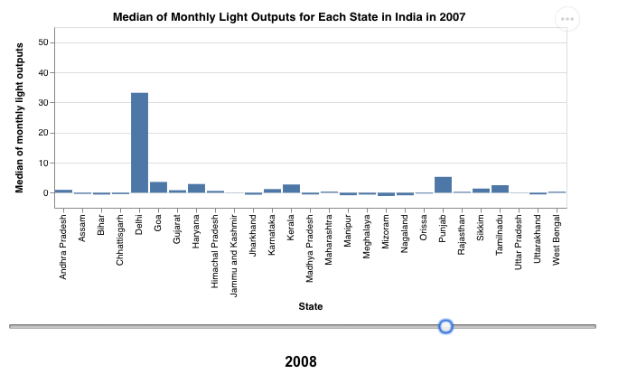
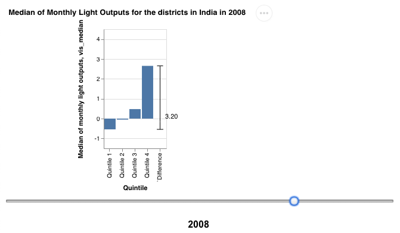
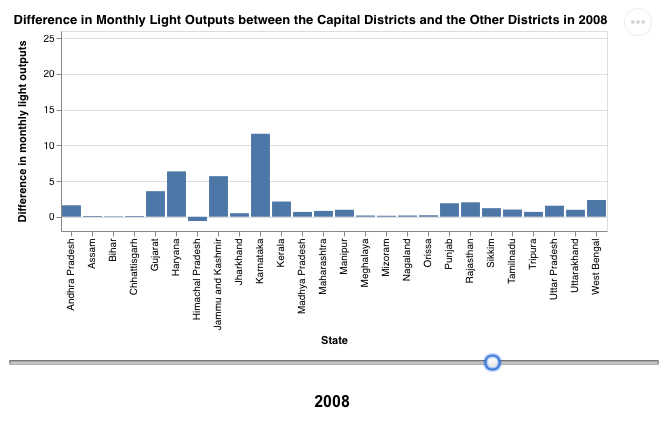

# India Light Outputs Analysis
This project is made for CSE 490c: Information and Communication Technology for Development (ICTD) class in Autumn 2018 at the Paul G. Allen School.

## About ##
This project analyzes India lights data from [India Lights API](http://api.nightlights.io). The data is processed using Python and then visualized using [Vega-Lite](https://vega.github.io/vega-lite/) library. 

The project consists of three graphs: 
1) The median of monthly light outputs for each state in India

2) The median of monthly light outputs of districts in India grouped into 4 quantiles

3) The difference in monthly light outputs between the capital district and other districts in each state.

## Launching the graphs ##
1. Clone the repository
2. Open .html file
